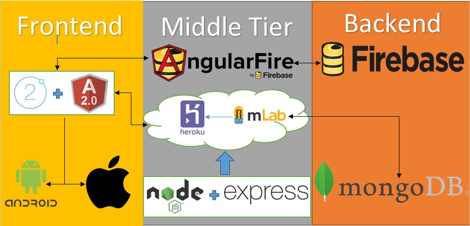

# Applied Project and Minor Dissertation

## Author: Kieran O'Halloran

## Student ID: G00326425

# Introduction.
This is a project which i completed for my 4th year Applied Project and Minor Dissertation module in GMIT. It is an application which uses the MEAN(MongoDB, Express.js, Angular.js and Node.js) stack with ionic. In the app users will be able to post jobs the are looking to get somebody to do for them. The users will also be able to directly message each other through the App.

## Features of the App

1. **User Authentication Using Firebase**

When a user opens the app they will be immeditaly greeted with a login screen for the app. From here the user can log in Using the online Firebase database that has been set up for secure authentiction. The User can log in with an existing account created for the app and if they forgot their password with a reset password feature which will email them a password reset link.

2. **The Job Page**

On the job page the user can create jobs, which will be seen by all other users of the application. They must enter a title, description, location and their maximum price by tapping the + icon on the top right corner of the app. They can also swipe a job to the left to delete it or message the creator of the job.

3. **The Message Page**

In this page the users can interact with each other and send private messages back and forth. The username, time and the message will be displayed for each message sent. The sent message will be left-allined and the recieved messages will be right-allined. 

## Architecture



___

# Compiling, Deploying and Running this Application.

To be able to install and run our app on your local maching follow the following steps.

## Steps for Running on a local machine.

1. **Install MongoDB on your machine and Start it.**

You can follow this [link](https://docs.mongodb.com/manual/installation/) to learn how to install and run MongoDB if you're new to the technology. If not you can just start running Mongo on your machine in the cammand line by running Monogd.exe and then in a new command line run mongo.exe.

2. **Install Node.js on your machine**

You can follow this [link](https://nodejs.org/en/) to download and install node on your machine. You need to have Node 6 or higher to run this application.

3. **Install Ionic on your machine.**

You can follow this [link](https://ionicframework.com/docs/intro/installation/) to learn how to install the ionic framework on        your machine. If you already have it installed then you should check if you're up to date with ionic 2. You can do this by runnning the following command...

```
>ionic info
```
Check the Ionic App lib version and it should be at least 2.0.0 to run this app.

4. **Clone this repository or download the .zip**

When you have the project files on your machine open the command line and navigate to the project directory. Make sure you are in the correct repositroy and run 
```
>npm install
```
This will install all the necessary node packages needed to run this application.

5. **Running the Application**

With MongoDB running and with all the above necessary instalations completed, navigate to the project folder, and run this command...
```
>node server.js
```
This will start the server for our API. Now open a internet browser and go to http://localhost:8080/ From here you can start using the app.

## How to Deploy the App on your Smart Phone.

To use this app on your smart phone device, Run
```
>cordova build
```
this will create the .apk file Install the .apk on your device and the app will then be installed on your phone. This app is built for Android and IOS.


